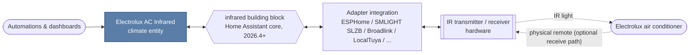

[](https://github.com/nikosavola/electrolux-ac-infrared/actions/workflows/test.yml)
[](https://github.com/nikosavola/electrolux-ac-infrared/actions/workflows/validate.yml)
[](https://codecov.io/gh/nikosavola/electrolux-ac-infrared)
[](LICENSE)
[](https://github.com/nikosavola/electrolux-ac-infrared/releases)

______________________________________________________________________

Home Assistant custom integration for Electrolux air conditioners controlled with an infrared
remote. It builds on the
[Infrared building block integration](https://www.home-assistant.io/integrations/infrared/)
added in Home Assistant 2026.4, so any IR transmitter Home Assistant exposes as an
infrared emitter (an ESPHome node with an IR LED, a SMLIGHT SLZB adapter, a Broadlink
blaster) can drive the air conditioner.

The integration only encodes the Electrolux IR protocol; it doesn't talk to hardware
directly.

## How it fits together

This integration is one link in a chain: the `infrared` building block is the interface
to whatever hardware actually emits (and optionally receives) infrared, provided by a
separate adapter integration:



This integration only produces or parses IR frames. The "Adapter integration" box is
whichever one matches your IR hardware, set up independently of this one. See the
[full list of `infrared` adapters](https://www.home-assistant.io/integrations/#infrared) for
what's available.

## Requirements

- Home Assistant 2026.4 or newer
- At least one `infrared` emitter entity, provided by an adapter integration such as
  ESPHome
- Optionally an `infrared` receiver entity, so Home Assistant follows along when the
  physical remote is used

## Installation

### HACS

[](https://my.home-assistant.io/redirect/hacs_repository/?owner=nikosavola&repository=electrolux-ac-infrared&category=integration)

1. Add this repository to HACS as a custom repository of type *Integration* (the
   badge above does this for you), then download **Electrolux AC Infrared** from HACS.
1. Restart Home Assistant.

### Manual

Copy `custom_components/electrolux_ac_infrared` into your Home Assistant `config/custom_components`
directory and restart Home Assistant.

## Configuration

Go to **Settings → Devices & services → Add integration**, pick **Electrolux AC Infrared**,
and select the infrared transmitter pointed at the air conditioner (optionally also a
receiver).

One transmitter drives one air conditioner; add another entry, with its own transmitter,
for a second unit. Change the transmitter or receiver later through **Reconfigure** on
the integration entry.

## Supported functionality

A single `climate` entity is created per air conditioner:

| Feature            | Values                                           |
| ------------------ | ------------------------------------------------ |
| HVAC modes         | off, heat/cool (auto), cool, heat, dry, fan only |
| Target temperature | 16–32 °C in 1 °C steps                           |
| Fan modes          | auto, low, medium, high                          |
| Swing modes        | off, vertical                                    |

Two quirks of the unit are mirrored by the entity, matching what the physical remote
does:

- In dry mode the fan always runs at low.
- Fan-only mode has no auto fan speed; requesting it selects low.

## Known limitations

- **Assumed state.** Infrared is one-way, so the entity shows what was last sent, not the
  unit's actual state. Using the physical remote or power-cycling the AC can drift it out
  of sync; state is restored across restarts.
- **Receive path is unverified against real hardware.** An infrared receiver reduces that
  drift: remote frames are decoded and applied to the entity. It's implemented from the
  same protocol description as transmit, but hasn't been checked against real hardware;
  an undecodable frame is just ignored, so it can't break sending.
- **No temperature readback.** The AC's own temperature sensor isn't readable over
  infrared, so the entity reports none. Pair it with a separate sensor if you need one.
- **Off means stored, not sent.** Changing fan speed, swing, or target temperature while
  off stores it for the next power-on instead of transmitting, since the AC can't act on
  it while off and firing the transmitter would just resend a power-off frame.
- **Restart-while-off loses the last mode.** A restart while the unit is off makes
  `climate.turn_on` fall back to cool rather than the last-used mode, since only the off
  state is restored.
- **Availability follows both entities.** With a receiver configured, the entity goes
  unavailable if *either* entity does, even though it could still transmit. That's Home
  Assistant core's shared infrared helper, not this integration.

## Supported devices

The protocol is shared across the Electrolux portable/window AC range. It has been
reported working on:

- EXP26U339HW
- EXP26U558CW
- EXP28U340CW
- EXP34U338HW

Other Electrolux units using the same remote are likely to work.

## Protocol

Every transmission is a single, complete 13-byte state frame sent once at a 38 kHz
carrier. There's no separate repeat or toggle bit, so re-sending the same frame is
always safe.

### Frame layout

| Byte(s)   | Field                                                             |
| --------- | ----------------------------------------------------------------- |
| `0`       | `0xC3` constant header                                            |
| `1`       | bits 7-5 swing, bits 4-0 temperature (`temp_c - 8`, bit-reversed) |
| `2`-`3`   | reserved, `0x00`                                                  |
| `4`       | fan speed                                                         |
| `5`       | reserved, `0x00`                                                  |
| `6`       | operating mode                                                    |
| `7`-`8`   | reserved, `0x00`                                                  |
| `9`       | bit 2 power                                                       |
| `10`-`11` | reserved, `0x00`                                                  |
| `12`      | checksum: bit-reversed sum of the bit-reversed leading 12 bytes   |

For example, cool mode, 24 °C, fan auto, power on encodes to:

```text
c3 e1 00 00 05 00 04 00 00 04 00 00 54
```

### Timings

| Segment              | Duration |
| -------------------- | -------- |
| Header mark          | 8950 µs  |
| Header space         | 4530 µs  |
| Bit mark (every bit) | 563 µs   |
| Space for a `1` bit  | 1690 µs  |
| Space for a `0` bit  | 538 µs   |
| Footer mark          | 563 µs   |
| Footer space         | 10000 µs |

Each of the 104 bits is a fixed-length mark followed by one of two space lengths, which
is what encodes its value.

The encoder lives in
[`electrolux_ac.py`](custom_components/electrolux_ac_infrared/electrolux_ac.py) and
implements the `infrared_protocols.commands.Command` interface, so it could move into
[infrared-protocols](https://github.com/home-assistant-libs/infrared-protocols) if the
protocol is ever added there.

## Versioning

Version numbers follow [ZeroVer](https://0ver.org/): the major version stays at 0
indefinitely, so a 0.y bump can carry breaking changes. See the
[releases](https://github.com/nikosavola/electrolux-ac-infrared/releases) for what
changed between versions.

## Contributing

See [CONTRIBUTING.md](CONTRIBUTING.md) for development setup and guidelines, and
[CODE_OF_CONDUCT.md](CODE_OF_CONDUCT.md) for community expectations. Found a security
issue? See [SECURITY.md](SECURITY.md) instead of opening a public issue.

## Credits

The protocol implemented here comes from
[the IR remote write-up on exploding-kitten.com](https://exploding-kitten.com/2025/05-diy-ir-remote)
and the [`esphome-electrolux-ac`](https://github.com/sys27/esphome-electrolux-ac)
ESPHome component by [@sys27](https://github.com/sys27), including the device quirks
above. This integration is licensed GPL-3.0 to match that component.
